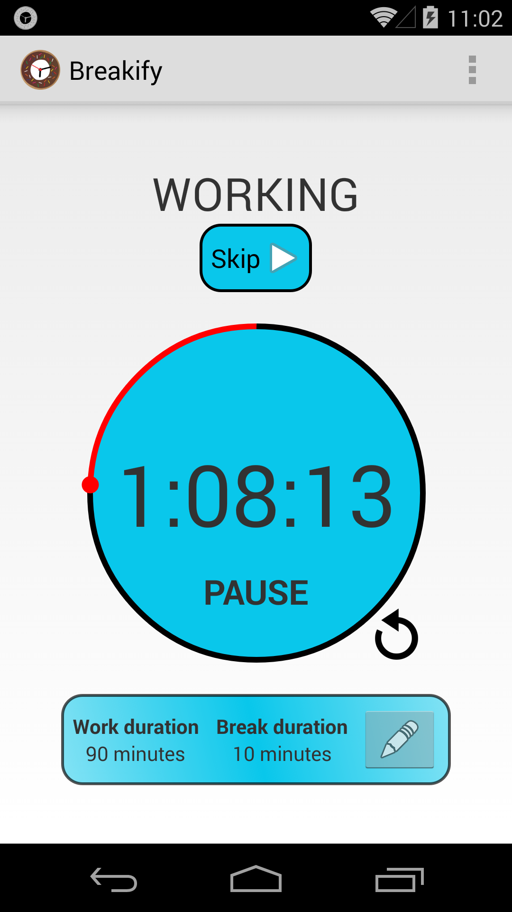

What is Breakify?
=============
Breakify is a simple Android app that reminds you to take breaks.

Why?
---
Because I notice that I'm constantly getting caught up writing code and doing other great things, and I forget to take breaks. That's not too healthy, and I also find that I'm _more productive_ after I take a quick break.

Features
---
- One click to start timer
- In the middle of something and can't stop just yet? No problem, just tap "Snooze"
- Reached a good place to take a break? Easily skip to your break, or vice versa
- Comes with 2 custom alarm tones
- Scheduled Start - opens automatically, so you don't have to remember to (enable in Settings)
- Privacy conscious? You can disable analytics in Settings

Todo
---
First of all, we need more tests.
Second, it would be nice to save statistics and show graphs of how much working v.s. breaking the user is getting in.
You can also see all the `TODO:` items in the code.
I'm writing this as a fun side project, so I'll get to things whenever I do. If you want to help out though, you're more than welcome to. Keep reading below for instructions.

Building and Running
---
Just clone this repository and build it in Android Studio, or run `./gradlew assembleDebug` or `./gradlew assembleRelease`.
To run the tests on a device or simulator, run `./gradlew connectedCheck`, or you can just use Android Studio and run the project with the "Android Tests" run configuration.

Contributing
---
Send me a pull request on Github.

License
---
GNU GPL v3.0, see LICENSE.txt

Screenshot
---

